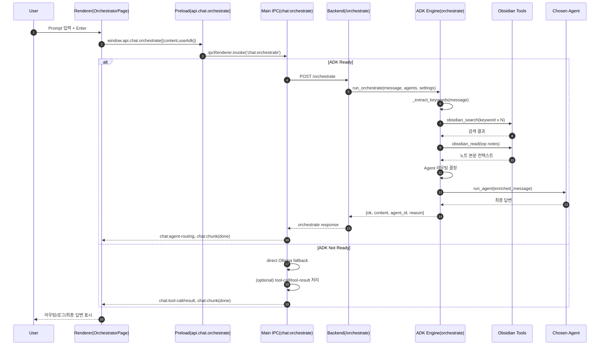
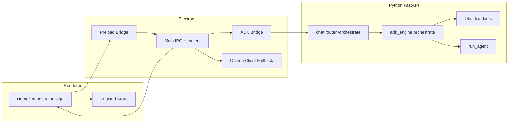

# PRD: Home 화면 Prompt 검색 플로우

## 1. 문서 목적
Home(Orchestrator) 화면에서 사용자가 Prompt를 입력했을 때, 검색(특히 Obsidian 기반 검색 컨텍스트 확보)이 어떤 구조로 호출되는지 제품 요구사항과 기술 흐름을 정리한다.

## 2. 범위
- 포함
  - Renderer(Home/Orchestrator) 입력 이벤트 처리
  - Electron IPC 브리지 호출
  - Main Process 오케스트레이션 분기(ADK 사용/미사용)
  - Backend 오케스트레이션 내 키워드 추출 + Obsidian 검색/읽기
  - 최종 응답 스트리밍 및 UI 반영
- 제외
  - Chat 화면의 일반 1:1 대화 흐름 상세
  - 외부 검색엔진(Bing/Google) 기반 웹 검색 툴 직접 연동

## 3. 사용자 스토리
- 사용자는 Home 화면에서 질문을 입력하고 전송한다.
- 시스템은 질문 의도를 분석해 적절한 Agent로 라우팅한다.
- 필요 시 Obsidian 노트를 사전 검색해 문맥을 보강한다.
- 사용자는 라우팅 결과, 처리 로그, 최종 답변을 확인한다.

## 4. 핵심 요구사항
1. Home 입력창에서 Enter 전송 시 오케스트레이션 요청을 시작해야 한다.
2. 요청은 IPC `chat:orchestrate` 채널을 통해 Main Process로 전달되어야 한다.
3. ADK 서버 사용 가능 시 Backend `/orchestrate`를 호출해야 한다.
4. Backend는 Obsidian 설정이 활성화된 경우:
   - 키워드 추출
   - 키워드별 Obsidian 검색
   - 상위 노트 본문 일부 읽기
   를 통해 컨텍스트를 구성해야 한다.
5. 다중 Agent 환경에서는 라우팅 규칙 + LLM 기반 라우팅으로 최적 Agent를 선택해야 한다.
6. 선택 Agent 응답은 사용자에게 최종 Assistant 메시지로 표시해야 한다.
7. 처리 과정은 Orchestrator 로그(입력, 라우팅, 에러 등)로 노출해야 한다.
8. ADK 비가용 시 Main Process에서 직접 Ollama fallback 경로를 수행해야 한다.

## 5. 성공 지표(KPI)
- 오케스트레이션 성공률: `ok=true` 응답 비율
- 평균 응답 시간: 입력 후 첫 응답 수신까지 시간
- 라우팅 정확도(정성): 사용자가 수동 재질문 없이 원하는 결과를 얻는 비율
- 컨텍스트 활용도: Obsidian 활성 상태에서 context_source가 `obsidian`인 비율

## 6. 화면/상태 요구사항
- 전송 직후
  - 사용자 메시지 즉시 표시
  - 스트리밍 상태 활성화
  - 라우팅 상태 초기화
- 처리 중
  - Thinking 블록 업데이트
  - Trace log 라이브 업데이트
  - 라우팅 완료 시 선택 Agent 표시
- 완료
  - 최종 Assistant 메시지 고정
  - 메시지별 Trace log 조회 가능
- 실패
  - Snackbar 형태로 에러 표시
  - 스트리밍/라우팅 상태 해제

## 7. 호출 구조(실제 코드 기준)

### 7.1 Renderer(Home)
- 파일: `src/renderer/src/pages/OrchestratorPage.tsx`
- 주요 함수:
  - `handleSend()`
  - `window.api.chat.orchestrate({ content, useAdk })`
- 주요 이벤트 리스너:
  - `onChunk`, `onOrchestratorThinking`, `onOrchestratorLog`, `onAgentRouting`, `onError`

### 7.2 Preload Bridge
- 파일: `src/preload/index.ts`
- 매핑:
  - `chat.orchestrate(...) -> ipcRenderer.invoke('chat:orchestrate', params)`

### 7.3 Main Process IPC
- 파일: `src/main/ipc-handlers.ts`
- 핸들러:
  - `ipcMain.handle('chat:orchestrate', ...)`
- 분기:
  - `isAdkReady() === true`
    - `orchestrateWithBackend(...)` 호출
  - `isAdkReady() === false`
    - direct Ollama fallback 실행

### 7.4 ADK Backend 경로
- 브리지 파일: `src/main/adk-bridge.ts`
  - `orchestrateWithBackend()` -> `POST http://127.0.0.1:7891/orchestrate`
- 라우터 파일: `backend/routers/chat.py`
  - `@router.post('/orchestrate')`
- 엔진 파일: `backend/adk_engine.py`
  - `orchestrate()`
    - `_extract_keywords()`
    - `obsidian_search()` 반복 수행
    - 상위 노트 `obsidian_read()`로 추가 문맥 확보
    - Agent 라우팅
    - `run_agent()` 실행

## 8. Mermaid 다이어그램

### 8.1 End-to-End 시퀀스


### 8.2 컴포넌트 구조


### 8.3 Backend 오케스트레이션 내부 로직
```mermaid
flowchart TD
    S[Start: /orchestrate request] --> C{Obsidian enabled\nand vault path exists?}
    C -- No --> R[Skip prefetch context]
    C -- Yes --> K[_extract_keywords]
    K --> Q[For each keyword:\nobsidian_search]
    Q --> D[Deduplicate note paths]
    D --> N[Read top notes: obsidian_read]
    N --> X[Build enriched context]
    R --> G[Select default/LLM route agent]
    X --> G
    G --> T{Context exists?}
    T -- Yes --> U[Strip search tools\n(obsidian_search/read/list)]
    T -- No --> V[Keep agent tools]
    U --> A[run_agent]
    V --> A
    A --> F[Return {ok, content, agent_id, reason, context_source}]
```

## 9. 예외/에러 처리 요구사항
- ADK backend 미기동 시 fallback 경로로 자동 전환
- 모델/서버 연결 실패 시 사용자 친화 메시지 제공
- 라우팅 실패 시 기본 Agent로 안전 폴백
- Obsidian 검색 실패는 경고 로그 처리 후 메인 플로우 지속

## 10. 테스트 관점(권장)
1. Home 입력 후 정상 라우팅/응답 렌더링 확인
2. ADK Ready/Not Ready 분기 동작 확인
3. Obsidian on/off 설정에 따른 컨텍스트 보강 여부 확인
4. 다중 Agent 환경에서 도구 기반 라우팅 정확도 확인
5. 에러 발생 시 Snackbar + 상태 복구 확인

## 11. 추적 가능한 코드 기준점
- Renderer Home 전송: `src/renderer/src/pages/OrchestratorPage.tsx`
- Preload IPC 매핑: `src/preload/index.ts`
- Main 오케스트레이션 핸들러: `src/main/ipc-handlers.ts`
- Backend 브리지: `src/main/adk-bridge.ts`
- Backend 엔드포인트: `backend/routers/chat.py`
- Orchestrate 핵심 로직: `backend/adk_engine.py`
