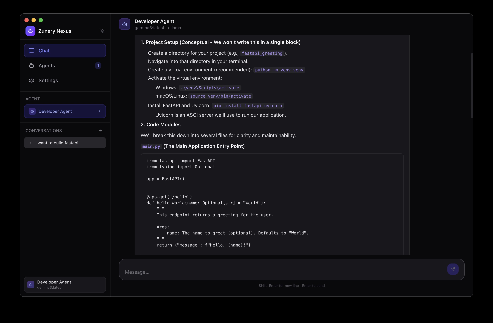
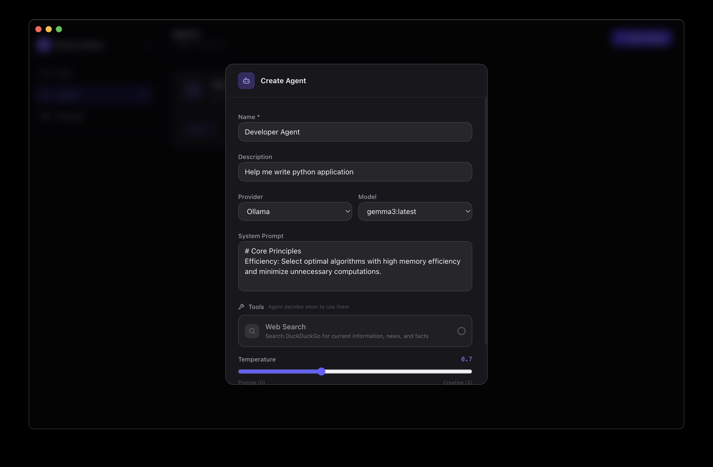

# Zunery Nexus — Quick Start & User Guide

Welcome to Zunery Nexus — a desktop app for creating and chatting with configurable AI agents. This guide is written for end users (not developers) and explains how to install, run, and use the app.

Getting started (installers)
- macOS / Windows / Linux: download the installer or zip from the project's Releases page on GitHub. Run the installer and follow the system prompts.

First run (what to expect)
- On first launch you'll see the sidebar (left) and the chat area (right).
- Create an Agent: open the "Agents" view and press "+ New Agent". Give it a name and choose a model/provider. The System Prompt field lets you set the agent's behavior.
- Start a Conversation: switch to "Chat", select an Agent, then click "+ New Conversation" or pick an existing conversation.

UI overview
- Sidebar: switch between Chat, Agents, and Settings. Also shows conversations for the selected agent.
- Chat view: the main chat area where messages appear. Type your message in the input at the bottom and press Enter to send.
- Agent editor: set the agent's name, model, system prompt, temperature, and enabled tools.
- ADK toggle: if ADK integration is available, a small toggle labeled "ADK" appears in the top bar — turn it on to route calls through the ADK server.

Using agents
- Create multiple agents for different tasks (e.g., "Research Assistant", "Draft Writer").
- Use the System Prompt to guide tone and behavior (e.g., "You are a concise technical writer.").
- Tools: some agents can call web tools like Web Search. When tools are used you may see inline sources or expandable tool result cards.

Conversations and messages
- Conversations are stored locally on your machine.
- Click a conversation to continue where you left off. Use the copy button to copy any message.
- Message metadata (like Web Search tool outputs) is shown under assistant messages; expand to view details.

ADK (optional)
- If the ADK integration is enabled in Settings, the app can use a local ADK server to run agents. This is optional — most features work without it.
- If you enable ADK, the app will show its status in the top-right bar. If ADK is not available, the toggle will be disabled.

Settings
- Open Settings to configure:
	- Default model/provider endpoints
	- ADK enablement and Python executable path
	- API keys (if using a remote LiteLLM provider)

Privacy & data storage
- Conversations and messages are stored locally in your user data folder.
- The app only sends data to external services if you configure a remote LLM provider or enable ADK.

Common questions
- Q: My icon or app name looks generic — can I change that?  
	A: Yes — icons and branding are packaged with the app. If you installed from Releases, the distributed installer includes app icons.

- Q: I enabled ADK but responses are failing — what do I do?  
	A: Check the ADK status indicator in the top bar. If it reports an error, try restarting the app. If the problem persists, contact the person who provided the build, or switch ADK off in Settings.

- Q: How do I export conversations?  
	A: Conversation export is not yet implemented in this release. To keep backups, copy important messages or snapshot the `user data` folder where the app stores conversations.

Support
- For installation packages or releases visit the GitHub Releases page. For bugs and feature requests open an issue and include your OS and a short description.

 
## Screenshots

- **Agent Chat:**

	

- **Create Agent Modal:**

	
